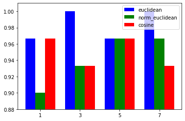
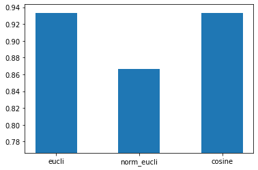

### Assignment 2

Name: Sravani Suravajhula
UTA Id:1001778007

## a.Divide the dataset as development and test


```python
import matplotlib.pyplot as plt
import numpy as np
import pandas as pd
from collections import Counter
np.random.seed(1)

data=np.genfromtxt('iris.csv',dtype=str,delimiter=',')
total_index=np.arange(0,data.shape[0])
np.random.shuffle(total_index)

train_index=total_index[:int(0.6*data.shape[0])]
train_data=np.asarray(data[train_index][:,:-1],dtype=np.float)
train_names=data[train_index][:,-1]


development_index=total_index[int(0.6*data.shape[0]):int(0.8*data.shape[0])]
development_data=np.asarray(data[development_index][:,:-1],dtype=np.float)
development_names=data[development_index][:,-1]

test_index=total_index[int(0.8*data.shape[0]):]
test_data=np.asarray(data[test_index][:,:-1],dtype=np.float)
test_names=data[test_index][:,-1]

print(train_index)
print(development_index)
print(test_index)

#print(dev_data)
#print(dev_names)
#print(test_data)
#print(test_names)
#print(dev_data.shape)

```

    [ 56  47  48  42  30 122  26 142 138  67  17  49  52  59  38  11 124  66
      51  71  75  25  99  24 149  44  53   6  83 121 148  60 120 136   2  62
      45  54 125  57  16 132  98  41 128  22  74   4  90 105 127 143 102 131
     104  29  39 117 113  12  50   8   9   0  80  77  13 140  21 133  55  91
     116  36 134   7 106 115 130  89 114 112  65  85 100  95  31 144  93  92]
    [ 27  73  76  43  15 145  94   1 107  46  32 137  82  87  81  33  88  35
      70  58  64 126  63  40 119 141 139 109  34   3]
    [110  10 108 111 103 147  86  78  79  23  61  68 146  14  96 101  37  72
      18 135  97  28   5  69 123  19 129 118  84  20]
    

## b.implementing knn using distance metric Euclidean distance


```python
def euclidean_distance(test_row,train_data):
    
    return np.sqrt(np.sum((train_data-test_row)**2,axis=1))

def knn(test_row,train_data,metric,k):
    dist=metric(test_row,train_data)
    require_index=dist.argsort()[:k]
    
    required_names=train_names[require_index]
    cnt=Counter(required_names)
    result=cnt.most_common()[0][0]
    
    return result 


#class_label=knn(dev_data[0],train_data,euclidean_distance,65)
#print(class_label)
    
```

## b.implementing knn using distance metric Normalized Euclidean distance


```python
def normalized_euclidean_distance(test_row,train_data):
    
    norm_train_data=(train_data-train_data.mean(axis=0))/train_data.std(axis=0)
    norm_test_row=(test_row-train_data.mean(axis=0))/train_data.std(axis=0)
    return np.sqrt(np.sum((norm_train_data-norm_test_row)**2,axis=1))

class_label=knn(development_data[0],train_data,normalized_euclidean_distance,65)
#print(class_label)
    
```

## b.implimenting knn using distance metric Cosine Similarity


```python
def cosine_similarity(test_row,train_data):
    dist=[]
    for rec in train_data:
        dot_product=np.dot(test_row,rec)
        mod_product=np.linalg.norm(test_row)*np.linalg.norm(rec)
        dist.append(1-(dot_product/mod_product))
    return np.array(dist)
#class_label=knn(development_data[0],train_data,cosine_similarity,65)
#print(class_label)
```

## c.calculating accuracy using Development dataset , finding optimal hyper parameters
## and drawing bar charts for accuracy


```python
def accuracy(verify_names,verify_data,train_data,metric,k):
    accurate=0
    for i,verify_row in enumerate(verify_data):
        class_label= knn(verify_row,train_data,metric,k)
        #print(class_label,verify_names[i])
        if(verify_names[i]==class_label):
            accurate+=1
    return accurate/verify_data.shape[0]

euclidean_accuracy=[]
normalized_euclidean_accuracy=[]
cosine_accuracy=[]
required_k= np.array([1,3,5,7])
for k in required_k:
    
    euclidean_accuracy.append(accuracy(development_names,development_data,train_data,euclidean_distance,k))
    normalized_euclidean_accuracy.append(accuracy(development_names,development_data,train_data,normalized_euclidean_distance,k))
    cosine_accuracy.append(accuracy(development_names,development_data,train_data,cosine_similarity,k))                                  

k=np.vstack((euclidean_accuracy,normalized_euclidean_accuracy,cosine_accuracy))
pd_test=pd.DataFrame(k,columns=['k=1','k=3','k=5','k=7'])
pd_test.index=['eucli','norm_eucli','cosine']
print(pd_test)

ax = plt.subplot(111)
ax.bar(required_k-0.5,euclidean_accuracy, width=0.5, color='b', align='center',label='euclidean')
ax.bar(required_k,normalized_euclidean_accuracy, width=0.5, color='g', align='center',label='norm_euclidean')
ax.bar(required_k+0.5,cosine_accuracy, width=0.5, color='r', align='center',label='cosine')

min_value=min((euclidean_accuracy+normalized_euclidean_accuracy+cosine_accuracy))
max_value=max((euclidean_accuracy+normalized_euclidean_accuracy+cosine_accuracy))
ax.set_xticks(required_k)
ax.set_ylim(min_value-0.02,max_value+0.01)
ax.legend()
```

                     k=1       k=3       k=5       k=7
    eucli       0.933333  0.966667  0.966667  0.966667
    norm_eucli  0.933333  0.900000  0.933333  0.966667
    cosine      1.000000  0.966667  0.966667  0.966667
    


    <matplotlib.legend.Legend at 0x1df0698a288>





From my observations at k=5 and k=7 we are getting consistent accuracy.i am choosing k=7 as it is optimal and consistent.

## d. with test data set finding final accuracy by using optimal hyper parameter


```python
eucli_test_accuracy=accuracy(test_names,test_data,train_data,euclidean_distance,7)

norm_eucli_test_accuracy=accuracy(test_names,test_data,train_data,normalized_euclidean_distance,7)

cosine_test_accuracy=accuracy(test_names,test_data,train_data,cosine_similarity,7)
plt.bar(['eucli','norm_eucli','cosine'],[eucli_test_accuracy,norm_eucli_test_accuracy,cosine_test_accuracy],width=0.5)
min_value=min(eucli_test_accuracy,norm_eucli_test_accuracy,cosine_test_accuracy)
max_value=max(eucli_test_accuracy,norm_eucli_test_accuracy,cosine_test_accuracy)
plt.ylim(min_value-0.1,max_value+0.01)


k=np.vstack((eucli_test_accuracy,norm_eucli_test_accuracy,cosine_test_accuracy))
pd_test=pd.DataFrame(k,columns=['k=7'])
pd_test.index=['eucli','norm_eucli','cosine']
print(pd_test)


```

                     k=7
    eucli       1.000000
    norm_eucli  0.966667
    cosine      0.933333
    





From my results above, the euclidean distance  with k=7 gives the best optimal accurasy.


```python

```


```python

```
